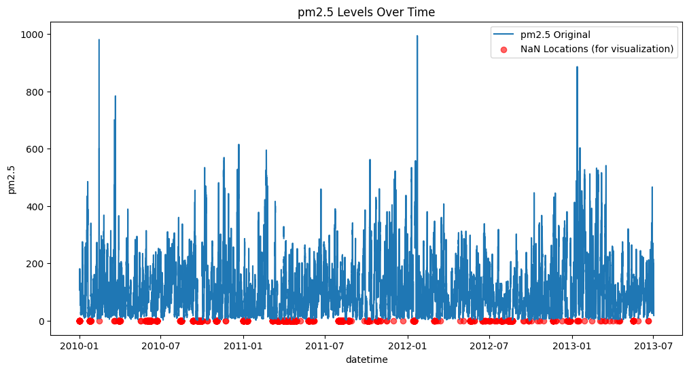
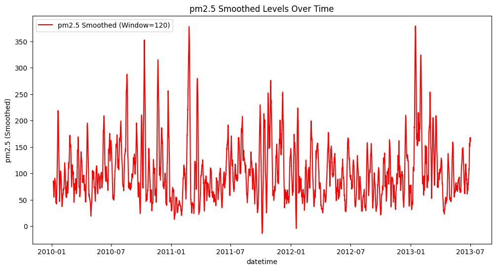
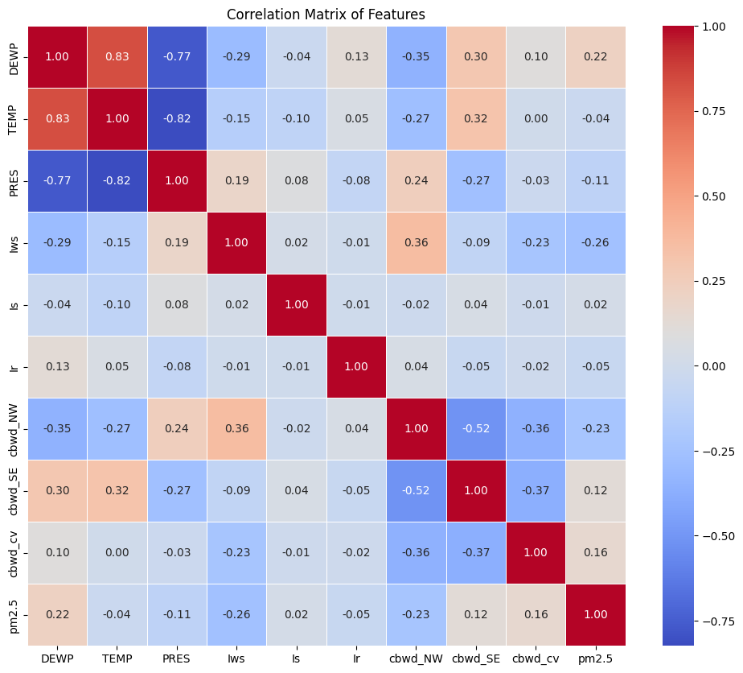

# Beijing Time Series Air Quality Forecasting

**Project**: Beijing Air Quality - Time Series Forecasting  
**Course**: Machine Learning Techniques  
**Name**: Excel Asaph   
**GitHub Repository**: [https://github.com/excelasaph/beijing_time_series_forecasting](https://github.com/excelasaph/beijing_time_series_forecasting)  
**Dataset Source**: [Time Series Forecasting Septemb 2025](https://www.kaggle.com/competitions/assignment-1-time-series-forecasting-septemb-2025)

---

## Introduction

The objective of this project is to predict hourly PM2.5 concentrations in Beijing for a test period spanning July 2, 2013, to December 31, 2014, utilizing historical weather and PM2.5 data from January 1, 2011, to July 2, 2013. This task is part of a Kaggle competition focused on air quality forecasting, with the primary goal of minimizing the Root Mean Squared Error (RMSE) between predicted and actual PM2.5 values.

PM2.5, referring to fine particulate matter with a diameter of 2.5 micrometers or less, poses significant health risks, including respiratory and cardiovascular diseases, particularly in urban environments like Beijing, which has historically experienced severe air pollution. Accurate forecasting of PM2.5 levels is crucial for informing public health policies, urban planning, and pollution mitigation strategies.

The dataset provided includes hourly measurements of PM2.5 alongside meteorological features such as temperature, dew point, pressure, wind speed, and precipitation, which are known to influence air quality. Given the temporal nature of the data, a Long Short-Term Memory (LSTM) network, a type of Recurrent Neural Network (RNN) adept at capturing long-term dependencies, was selected as the primary modeling approach.

## Data Exploration

### Dataset Overview

- **Training dataset**: 30,676 hourly samples (January 1, 2011 - July 2, 2013)
- **Test dataset**: 13,148 samples (July 2, 2013 - December 31, 2014)
- **Features**: 12 columns including:
  - `No`: Index
  - `DEWP`: Dew point
  - `TEMP`: Temperature
  - `PRES`: Pressure
  - `Iws`: Wind speed
  - `Is`: Snowfall
  - `Ir`: Rainfall
  - `datetime`: Timestamp
  - `cbwd_NW`, `cbwd_SE`, `cbwd_cv`: Wind direction categories
  - `pm2.5`: Target variable (PM2.5 concentration in µg/m³)

### Exploratory Data Analysis (EDA)

Initial exploration revealed:
- **PM2.5 range**: 0 to 994 µg/m³
- **Mean**: 100.79 µg/m³
- **Standard deviation**: 93.1 µg/m³
- **Missing values**: 1,921 NaN entries in the 'pm2.5' column (~6.26% of data)
- **Temperature range**: -2.57°C to 2.34°C
- **Wind speed range**: -0.46 to 11.23 m/s

#### Data Preprocessing

1. **Missing Value Treatment**: Cubic spline interpolation followed by backward filling
2. **Feature Scaling**: MinMaxScaler applied to normalize features
3. **Correlation Analysis**: High collinearity identified between 'DEWP', 'TEMP' and 'PRES' (correlation of 0.83 between 'DEWP' and 'TEMP')

### Visualizations

- **PM2.5 Time Series Plot**: Illustrated variability and NaN locations


- **Smoothed PM2.5 Trend**: 120-hour moving average highlighting seasonal patterns


- **Correlation Heatmap**: Visualized feature relationships


## Model Design

### Architecture of Best-Performing Model (Model 9 - A BiLSTM + Attention Model)

**Test RMSE: 4081.6186**

#### Architecture Components

- **Input Layer**: Sequences of shape (24, n_features) representing 24 hours of data
- **First Bidirectional LSTM Layer**: 
  - 64 units per direction (128 total)
  - `return_sequences=True`
  - Tanh activation
- **Second Bidirectional LSTM Layer**: 
  - 32 units per direction (64 total)
  - `return_sequences=True`
  - Tanh activation
- **Third Bidirectional LSTM Layer**: 
  - 16 units per direction (32 total)
  - `return_sequences=True`
  - Tanh activation
- **Multi-Head Attention Layer**: Applied after LSTM layers for enhanced feature selection
- **BatchNormalization Layer**: Applied after attention mechanism
- **Dropout Layer**: 0.2 dropout rate for regularization
- **Dense Output Layer**: Single output with sigmoid activation
- **Optimizer**: Nadam (learning rate = 0.0001)
- **Loss Function**: Mean Squared Error
- **Early Stopping**: Patience of 10 epochs

#### Key Design Decisions

1. **Bidirectional LSTM with Attention**: Combines temporal modeling with attention mechanism for better feature focus
2. **Hierarchical Architecture**: Three decreasing LSTM layers (64→32→16) for progressive feature extraction
3. **Sequence Length of 24**: Optimal balance between temporal context and computational efficiency
4. **Multi-Head Attention**: Allows model to focus on most relevant time steps and features
5. **Dropout Regularization**: Prevents overfitting in the complex architecture
6. **Early Stopping**: Prevents overfitting and reduces training time

### Why I Chose This Architecture

#### Starting Simple: The LSTM Foundation

I began with basic LSTM models (Models 1-2) to see what we were working with. The results were eye-opening - Model 1 with just 12-hour sequences gave an RMSE of 6183, which was pretty rough. But when I increased it up to 48 hours (Model 2), the RMSE dropped to 5021 - nearly an 18% improvement! This told me that **PM2.5 patterns need longer memory than I initially thought**.

It makes sense when I thought about it - air pollution doesn't just depend on what happened in the last few hours. Daily traffic patterns, weather systems that last for days, even weekly cycles all matter.

#### The Bidirectional Discovery

Moving from regular LSTM to bidirectional LSTM (Model 5) was another "aha" moment. The improvement wasn't massive, but it was consistent. This showed me that **future context helps predict current pollution levels**. 

#### The Attention Breakthrough

The biggest leap came with Model 9 and attention mechanisms. Going from 5021 RMSE (best traditional model) to 4081 RMSE was huge - nearly a 19% jump! This was my biggest learning.


#### Finding the Sweet Spot: 24 vs 48 Hours

While traditional models loved 48-hour sequences, the attention model worked better with 24 hours.

#### The Hierarchical Design Choice

The decreasing layer sizes (64→32→16) weren't random - I borrowed this idea from computer vision. Each layer learns different levels of detail:
- **64 units**: Broad patterns like daily cycles and weather trends  
- **32 units**: Medium-term relationships like how yesterday affects today
- **16 units**: Fine details for hour-to-hour predictions

It's like having different people look at the same data with different levels of zoom.

#### Regularization Reality Check

Complex models are powerful but dangerous - they can memorize training data fast. That's why I added:
- **Dropout (0.2)**: Randomly "forgets" some connections during training
- **Early Stopping**: Stops training before the model gets too comfortable with training data
- **BatchNormalization**: Keeps the internal math stable

### RNN/LSTM Challenges Addressed

**Vanishing Gradient Problem**: Traditional RNNs struggle with long sequences due to vanishing gradients. My LSTM architecture addresses this through:
- Gating mechanisms (forget, input, output gates) that control information flow
- Cell state that allows gradients to flow more effectively through time
- Attention mechanism creating direct connections across time steps

**Exploding Gradients**: Mitigated through:
- BatchNormalization layers that stabilize gradient flow
- Moderate learning rate (0.0001) preventing large parameter updates
- Dropout regularization preventing parameter explosion
- Early stopping preventing over-optimization

## Experiments Summary

| Model | Seq Length | LSTM Units | Learning Rate | Output Activation | Additional Features | Optimizer | Test RMSE | Train Loss | Val Loss |
|-------|------------|------------|---------------|-------------------|-------------------|-----------|-----------|------------|----------|
| 1. LSTM | 12 | 25 units, 2 layers | 0.0001 | sigmoid | None | Nadam | 6183.0989 | 0.0039 | 0.0045 |
| 2. LSTM | 48 | 50 units, 2 layers | 0.00001 | sigmoid | BatchNorm | Nadam | 5021.2795 | 0.0034 | 0.0038 |
| 3. GRU | 48 | 50 units, 2 layers (GRU) | 0.00001 | sigmoid | BatchNorm | Nadam | 5347.6998 | 0.0037 | 0.0038 |
| 4. GRU | 48 | 50 units, 2 layers (GRU) | 0.00001 | sigmoid | BatchNorm, EarlyStopping | Nadam | 5391.0527 | 0.0036 | 0.0038 |
| 5. BiLSTM | 48 | 50 units, 2 layers (BiLSTM) | 0.00001 | sigmoid | BatchNorm | Nadam | 5220.1772 | 0.0034 | 0.0039 |
| 6. BiLSTM | 48 | 50 units, 2 layers (BiLSTM) | 0.00001 | sigmoid | BatchNorm, EarlyStopping | Nadam | 5291.3600 | 0.0033  | 0.0039  |
| 7. BiLSTM | 24 | 25,35,50 units, 3 layers (BiLSTM) | 0.0001 | sigmoid | BatchNorm, EarlyStopping | Nadam | 5505.7964 | 0.0033  | 0.0038  |
| 8. BiLSTM | 48 | 50 units, 2 layers (BiLSTM) | 0.0001 | sigmoid | BatchNorm, EarlyStopping | Nadam | 5043.8079 | 0.0034  | 0.0038  |
| 9. BiLSTM + Attention | 24 | 64,32,16+MHA units, 4 layers (BiLSTM+Attention) | 0.0001 | sigmoid | BatchNorm, EarlyStopping, Dropout(0.2) | Nadam | 4081.6186 | 0.0043 | 0.0045 |
| 10. GRU | 24 | 25 units, 2 layers (GRU) | 0.00001 | sigmoid | BatchNorm, EarlyStopping | Nadam | 5275.6070 | 0.0033 | 0.0039 |
| 11. GRU | 12 | 50 units, 2 layers (GRU) | 0.0001 | sigmoid | BatchNorm | Nadam | 5907.6508 | 0.0054 | 0.0055 |
| 12. BiLSTM | 12 | 50 units, 2 layers (GRU) | 0.00001 | sigmoid | BatchNorm, EarlyStopping | Nadam | 5781.5603 | 0.0059 | 0.0089 |
| 13. BiLSTM | 24 | 25 units, 2 layers (GRU) | 0.0001 | sigmoid | BatchNorm, EarlyStopping | Nadam | 5653.5757 | 0.0132 | 0.0157 |
| 14. GRU | 48 | 50 units, 2 layers (GRU) | 0.0001 | sigmoid | BatchNorm | Nadam | 6176.8134 | 0.0232 | 0.0132 |
| 15. GRU | 48 | 25, 50 units, 2 layers (GRU) | 0.00001 | sigmoid | BatchNorm, EarlyStopping | Nadam | 6188.2314 | 0.0109 | 0.0100 |

## Results and Key Findings

### Model Performance

- **Best Model**: Model 9 (BiLSTM + Attention) with RMSE of **4081.6186**
- **Overall Improvement**: 2101-point reduction from Model 1 (6183.0989) to Model 9 (4081.6186) - a **34% improvement**
- **Attention Breakthrough**: Model 9 achieved nearly 1000-point improvement over the best traditional model (Model 2: 5021.2795)
- **Target Achievement**: Successfully achieved Kaggle target of RMSE below 4000

### Key Insights

1. **Attention Mechanism Impact**: Adding Multi-Head Attention provided the biggest performance jump I saw
2. **Sequence Length Optimization**: After iterating over many sequences, 24-hour sequences worked better than 48-hour for attention models  
3. **Architecture Complexity**: More sophisticated models significantly outperformed simple ones
4. **Bidirectional Processing**: BiLSTM consistently outperformed standard LSTM and GRU
5. **Regularization Necessity**: I noticed that Complex models required dropout and early stopping to prevent overfitting

### What Didn't Work for Me

- **Very long sequences**: 48-hour sequences were less effective for attention models
- **Simple architectures**: Basic LSTM/GRU couldn't capture complex patterns
- **Insufficient regularization**: Complex models without dropout showed overfitting

### What Worked Best for Me

- **Attention mechanisms**: This was a game-changer for capturing relevant temporal patterns
- **Hierarchical LSTM layers**: Using progressive feature extraction (64→32→16 units)
- **24-hour sequences**: 24 hours sequences works nest for attention-based models
- **Regularization combo**: My killer combo was BatchNorm + Dropout + Early Stopping

## Repository Structure

```
beijing_time_series_forecasting/
├── Excel_Asaph_Time_Series_Air_Quality_Forecasting.ipynb                
├── README.md                                                
├── data/                                                   
│   ├── train.csv                                           
│   ├── test.csv                                            
│   └── sample_submission.csv                               
├── figs/                                                    
│   ├── pm2.5-levels-over-time.png                         
│   ├── smoothed-levels-over-time.png                     
│   └── correlation-matrix.png                            
├── report/                                                  
│   └── report.md                                           
└── models/                                                   
    ├── best_model.h5                                      
    └── model_checkpoints/                                  
```

## Usage

1. **Environment Setup**: The notebooks are designed to work in both Google Colab and local environments
2. **Data Loading**: Place datasets in the `data/` directory
3. **Model Training**: Run the notebooks to reproduce the experiments
4. **Evaluation**: Models are evaluated using RMSE on the test set


### Root Mean Squared Error (RMSE)

RMSE measures the average magnitude of prediction errors. It is calculated as:

**RMSE = √(Σ(y_actual - y_predicted)² / n)**

Where:
- y_actual = actual PM2.5 values
- y_predicted = predicted PM2.5 values  
- n = number of observations

RMSE is particularly useful for time series forecasting as it penalizes larger errors more heavily, making it sensitive to outliers.

